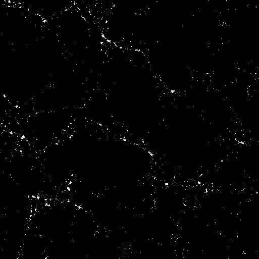
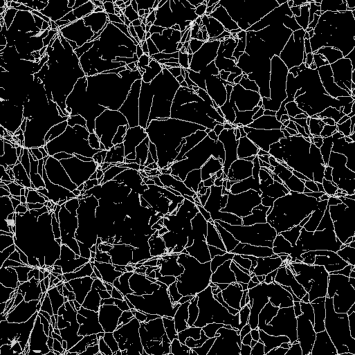
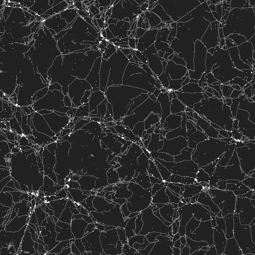

# Data description (cosmic web)

For this project I am using the Bolshoi simulation, a very large simulation of a significant volume of the Universe. This is the website of the simulation, it is not relevant for the discussion but if you are interested (there are some nice images/videos showing various aspects of the simulation:

http://hipacc.ucsc.edu/Bolshoi.html

We already have density fields and the network of filaments form an old project. The data consist of cubes of 256x256x256 voxels containing different spects of the the density field. 

## Density
The figure below shows a projection of the density field. Bright areas are dense clusters of galaxies. Note how the clusters are interconnected by a network of filaments.

## Clusters / soma
Here I applied a density threshold to highlight the dense clusters of galaxies. Clusters are the nodes of the network of filaments. So they are similar to the "soma" of a neuron.

## Filaments / dentrites
The next image shows the network of filaments connecting clusters. Filaments are, in our context, equivalent to the dentrites (there is no functional equivalent to an axon I think). The filaments were computed using the Spine algorithm (only for reference):

http://adsabs.harvard.edu/abs/2010ApJ...723..364A

## Cosmic neurons
Here we see only very dense regions (roughly corresponding to clusters) and on top the network of filaments.

